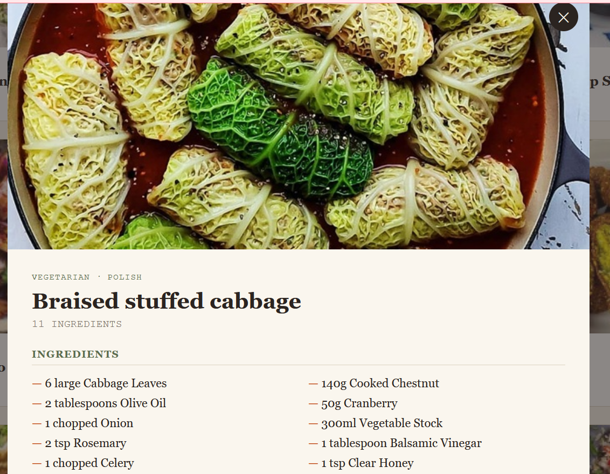

# 🍽️  Recipe Finder

A modern and responsive Recipe Finder web application that helps users discover delicious recipes from around the world. Users can search recipes by name, browse recipes by category or cuisine, save favorites, and view detailed cooking instructions with ingredients.

## 🌟 Features

- 🔍 Search recipes by meal name
- 🌎 Browse recipes by cuisine (e.g., Indian)
- 🍰 Filter recipes by category
- 🎲 "Surprise Me" random recipe generator
- ❤️ Save favorite recipes using Local Storage
- 📋 View complete recipe details
- 🥕 Ingredient list with measurements
- 👨‍🍳 Step-by-step cooking instructions
- 📱 Fully responsive design
- ⚡ Fast and user-friendly interface

---

## 🛠️ Built With

- HTML5
- CSS3
- JavaScript (ES6)
- TheMealDB API
- Local Storage

---

## 📂 Project Structure

```
Recipe_Finder/
│── index.html
│── README.md
│── screenshot.png      (Optional)
```

---

## 📸 Screenshot



```

```

---

## 🚀 How to Run

1. Download or Clone the repository.

```bash
git clone https://github.com/YOUR_USERNAME/Recipe_Finder.git
```

2. Open the project folder.

3. Open **index.html** in your browser.

Or use **Live Server** in VS Code for a better experience.

---

## 🔗 API Used

This project uses the free **TheMealDB API** to fetch recipe information.

https://www.themealdb.com/api.php

---

## 💡 Future Enhancements

- Dark Mode
- Voice Search
- Recipe Videos
- Nutrition Information
- Ingredient-based Search
- Meal Planner
- User Login
- Share Recipes

---

## 🎯 Learning Outcomes

- Working with REST APIs
- Fetch API in JavaScript
- DOM Manipulation
- Event Handling
- Local Storage
- Responsive Web Design

---

## 👩‍💻 Author

**Deepshikha Singh**

If you like this project, don't forget to ⭐ the repository!